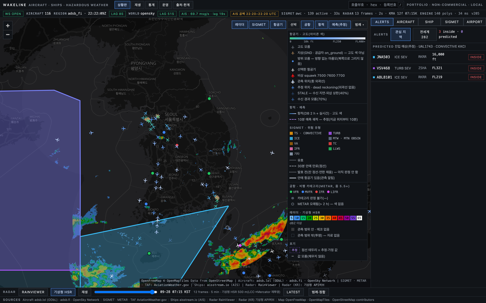
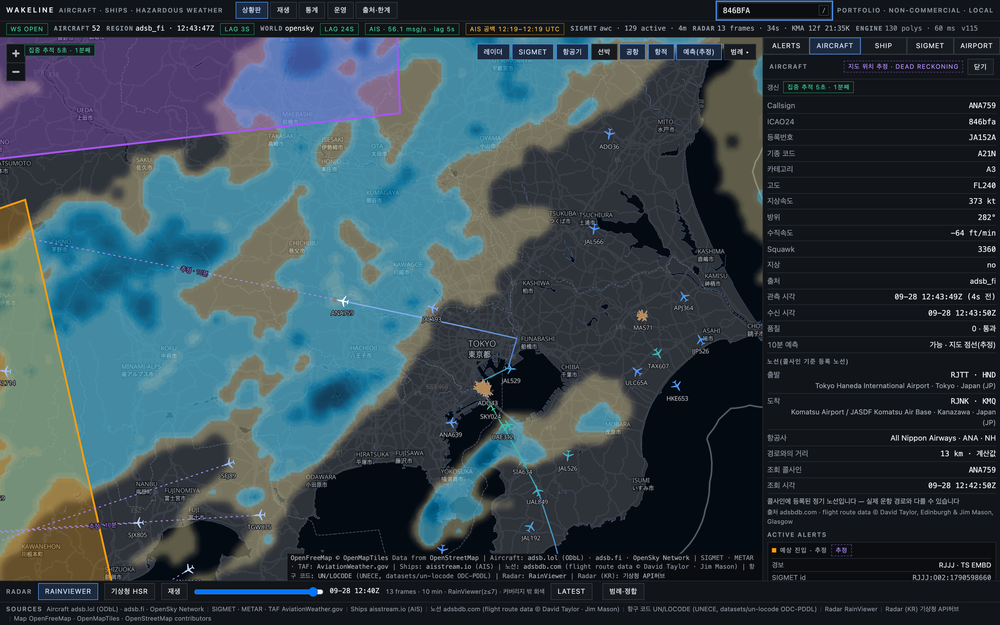
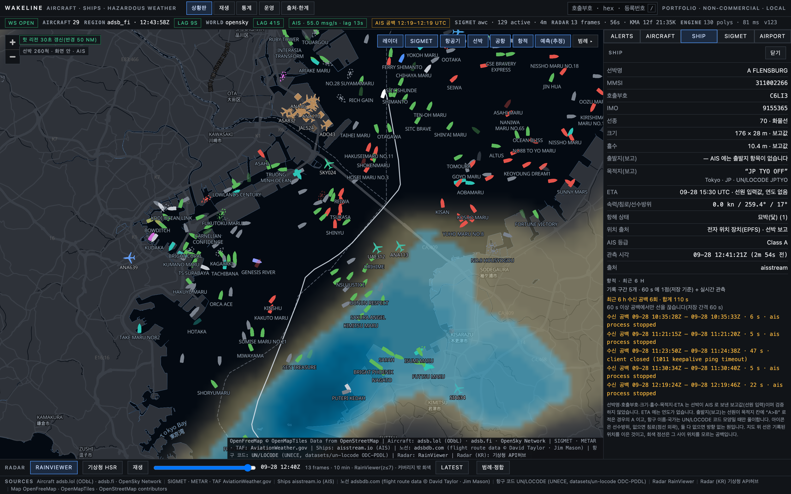
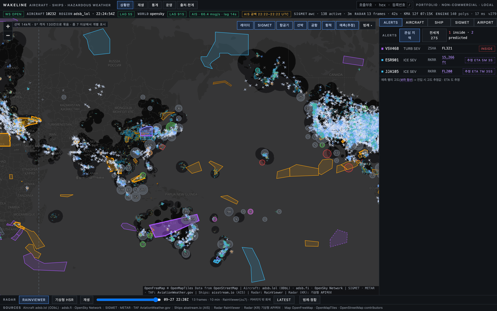
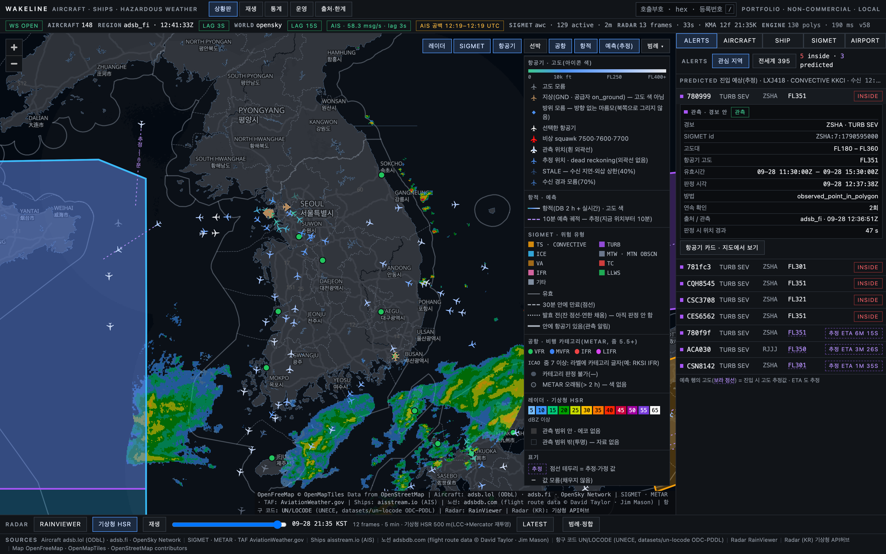
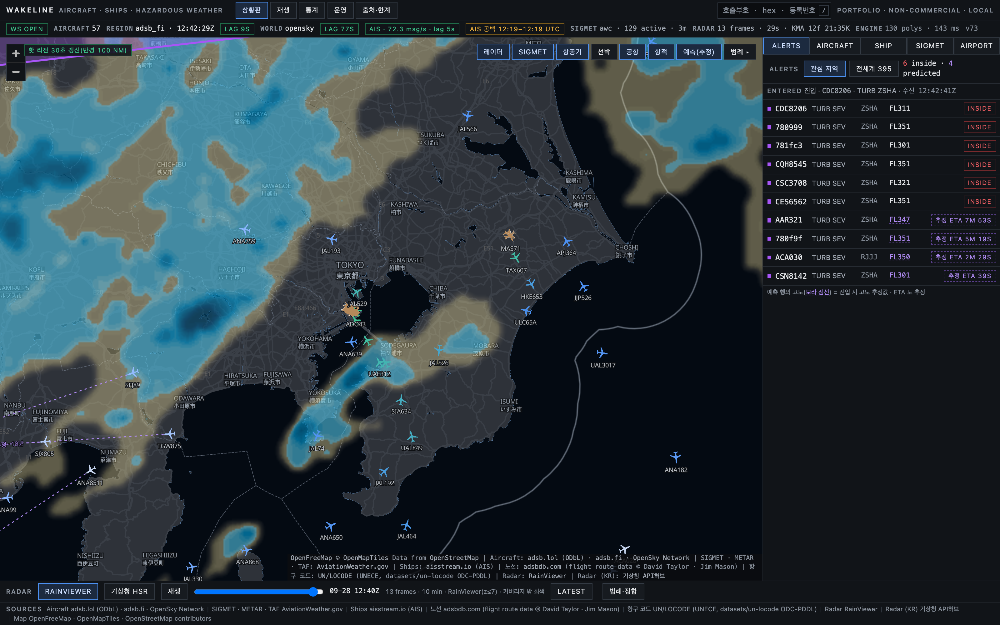
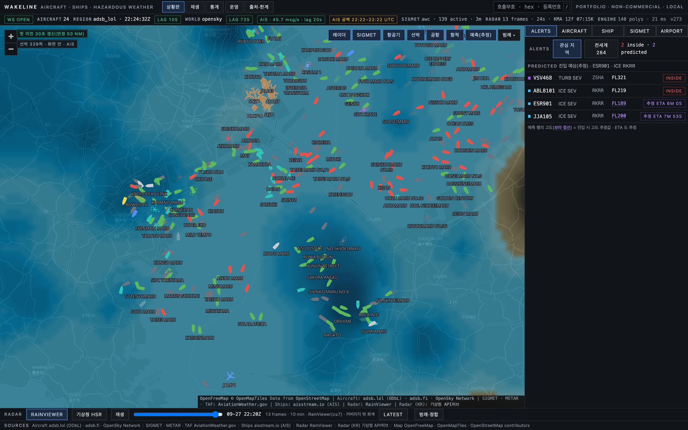
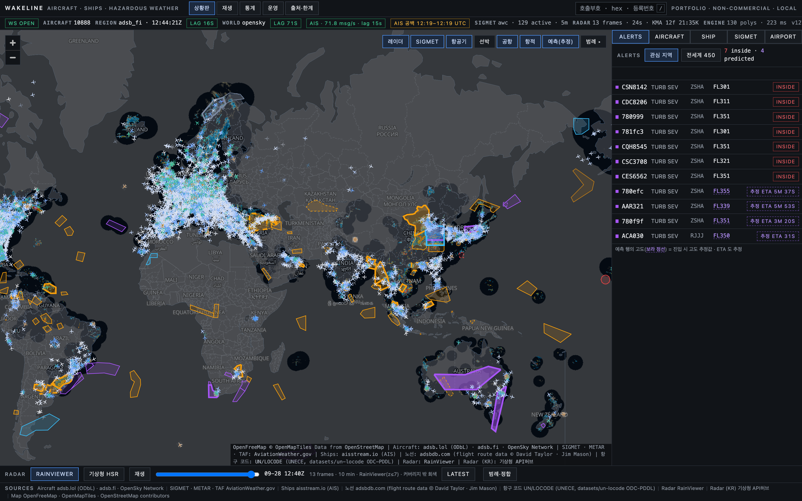
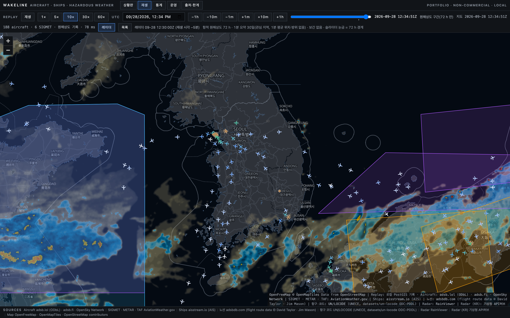
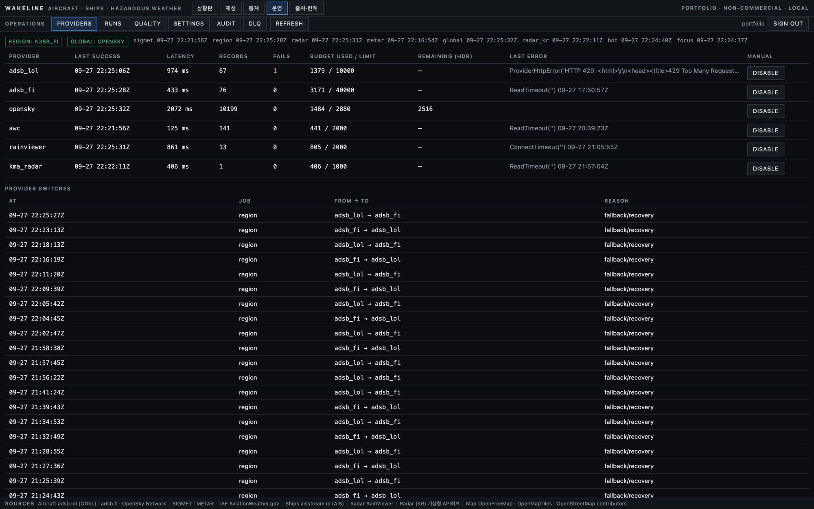

# Wakeline — 실시간 항공기 · 선박 · 위험기상 상황판

전세계 항공기(ADS-B)와 선박(AIS), 기상 레이더, 항공 위험기상 경보(SIGMET), 공항 기상(METAR/TAF)을 한 지도에 겹칩니다.
**"지금 SIGMET 안에 있는 항공기"** 와 **"10분 안에 들어갈 항공기"** 를 근거 카드와 함께 실시간으로 찾습니다.
확대해 보는 곳과 고른 항공기는 서버가 따로 더 촘촘히 추적합니다(핫 리전 30 초, 집중 추적 5 초).



> 개인 학습·포트폴리오용 · 비상업 · 로컬 실행입니다. 운항 판단에 쓰면 안 됩니다.
> 모든 값에 출처와 관측 시각이 붙습니다. 모르는 값은 `—` 로 두고, 보간·예측값은 항상 "추정" 으로 표시합니다.

## 한눈에

| | |
|---|---|
| **역할** | 1인 기획·설계·구현·검증(수집기 · API/WS/공간 엔진 · 화면 · 인프라 · 성능·장애 시험) |
| **스택** | nginx · Next.js 16 / React 19 / MapLibre GL 6 · Spring Boot 4.1(Java 25, 가상 스레드, JTS) · Python 3.13(asyncio, httpx, websockets, shapely) · PostgreSQL 18 + PostGIS 3.6 · Redis 8 Streams · Docker Compose |
| **구성** | 상시 컨테이너 7개(edge · web · api · collector · ais · redis · db) + 일회성 migrate(Flyway V1–V15) |
| **데이터** | 항공기 adsb.lol · adsb.fi · OpenSky · 노선 adsbdb(선택 시만, 저장 안 함) / 선박 aisstream.io · 항구 UN/LOCODE · 한국 항만 입출항 해양수산부 PORT-MIS(공공데이터포털, 수집기가 항만청 10곳을 날짜별로 색인) · 연안 교통량 한국해양교통안전공단 실시간 해양교통정보 + 해양수산부 해양격자 4단계(공공데이터포털) / 기상 AviationWeather.gov · RainViewer · 기상청 API허브 레이더(HSR) / 지도 OpenFreeMap |
| **검증** | 자동 시험 3,822건(pytest 1,381 · JUnit 788 · Vitest 1,064 · Playwright E2E 18 · 인프라 정책 122 · 버리는 컨테이너 시험 449) · 적대적 리뷰 2회(97건 · 19건 수정) · **리뷰 v1**(기준선 측정 → 진단 98건(고유 97 + 3단계 추가 R-98) → 승인 85 · 보류 13 → 수정(R-63 은 사용자 결정 대기, 일부는 부분 처리 — review §5.2) · 2차 검토 35건 · 문서 사실 확인 2회 → 재측정, [review](docs/review/VERIFICATION.md)) · 장애 주입 6종 · 실측 문제 기록 52건([VERIFICATION](docs/VERIFICATION.md)) |
| **성능(실측)** | REST 100 rps p95 5.1–17.9 ms(경합 기록이 없는 오전 실행 6회) · WS 200 연결 p95 123–287 ms(목표 500) · api 메모리 경합 기록이 없는 오전 k6 실행 약 500 MiB(목표 512 — 같은 기계에 부하가 겹치면 577–611 MiB, 최종 측정 527 MiB: 미충족·다음 후보) · 첫 화면 JS 520.6 KiB(리뷰 v1 뒤 497.7 → 계약 v5 의 통합 검색·선박 표·이중 단위·브라우저 오류 보고와 오류 화면·WS 검증으로 +22.9 KiB — 목표 400 KB 미충족, 목표 재설정은 사용자 결정 대기) · 집중 추적 관측 간격 중앙값 5.05 s · api 크래시 복귀 6.2 s([PERF](docs/PERF.md)) |
| **설계 기록** | ADR 24건([docs/adr](docs/adr)) · 변경 계약 v1–v5([docs/audit](docs/audit)) |

## 1. 무엇을 하나

| 영역 | 기능 |
|---|---|
| 항공기 | 관심 지역(한반도 반경 250 NM, 10 s) · 전세계(OpenSky, 120 s) · **뷰포트 핫 리전**(줌 7 이상이고 관심 지역 밖이면 화면 중심 반경 ≤ 250 NM 을 30 s 마다, 줌 아웃·이동·보는 사람 없으면 60 s 안에 해제) · **선택 항공기 집중 추적**(ICAO 24-bit hex 로 전세계 어디서든 5 s, 세션당 30분 상한) · **출발·도착 공항**(선택한 항공기의 콜사인으로 adsbdb 등록 노선 조회 — 선택할 때만 호출, Redis 캐시 30분, DB 저장 없음, "등록 노선이며 실제 경로와 다를 수 있음" 표기) · 검색 · 항적(공급자별 수신 공백 표시) · 10분 예측(추정) |
| 위험기상 | SIGMET 폴리곤 + 고도대 + 유효시간으로 구조화 → STRtree 교차 판정 → 히스테리시스 상태기계(진입 2회·이탈 3회) → 관측/예측 알림 근거 카드 · RainViewer / 기상청 HSR 레이더(LCC → 메르카토르 서버 재투영 · 프레임마다 합성 지점 수 "합성 12/15곳" — 일부 지점만 합성된 프레임은 경고와 함께 표시하고 기한까지 다시 받기 대상, '완전'이라고는 하지 않음, ADR-021) · METAR/TAF |
| 선박 | AIS 실시간(구역별 연결 2개) · 선종별 색 · 선수방위 회전(없으면 침로 점선, 둘 다 없으면 원) · **적응형 표시**(줌 ≥ 7 은 5,000척, 줌 4–7 은 1,500척까지 개별 점 — 넘으면 격자 집계) · 카드(선명·선종·크기·흘수·목적지·ETA — 모두 "보고값") · **목적지 해석**(보고 문자열을 UN/LOCODE 표로 결정적으로 풀이 — `A>B`·`A<>B` 형식, 이름이 겹치면 "모호" 표시, 못 풀면 원문만) · **통합 검색**(상단 한 칸에서 항공기와 함께 — 선명·호출부호 앞부분 · MMSI · IMO, 실시간 + 저장된 선박, 실시간이 아니면 "마지막 수신" 시각) · **선종 필터**(격자 칸도 선종별 수로 다시 셈 — 고른 선박은 필터·표시 상한과 무관하게 항상 표시) · 정렬되는 선박 목록 · 항적 6/12/24 h(점마다 시각·속도) · **수신 공백 기록·표시**(구역 단위) · 수신 범위 경계 · 선박이 0척이면 이유(범위 밖·공급자 공백·수신 끊김)를 표시 · **한국 항만 입출항**(수집기가 해양수산부 PORT-MIS 항만청 10곳의 입출항 신고를 KST 날짜별로 모두 받아 DB 에 색인(최근 30일 · 매시 최근 3일 다시 · 60일 보관) — 선택한 선박의 AIS 호출부호로 색인을 찾을 뿐 선택마다 외부에 묻지 않음, 입항·출항 KST(최종 신고 우선 · 판 표시 · 원천이 날짜인지 자정인지 구분하지 않는 00:00 신고는 날짜만) · 선석 · 목적 · 전출항지 → 차항지, "기록 없음"은 10곳 색인이 창 전체(오늘 목록까지 · 끝까지 색인하지 못한 날 없음) · 2시간 안 갱신일 때만(아니면 항만청별 빈 곳과 그 날짜), 두 선명이 모두 영문이고 다르면 경고, ADR-022 개정) |
| 연안 교통량 | **레이어 "연안 교통량(KOMSA)"**(기본 끔) — 한국해양교통안전공단이 5분마다 집계한 해양격자 칸(0.025°, 약 2.2×2.8 km)별 선박 척수를 색으로(개별 선박 위치 아님) · 칸 위치는 해양수산부 해양격자 4단계 WFS 에서 칸마다 한 번 받아 EPSG:5179 를 순수 Python 으로 풀고 0.025° 격자에 맞는지 검사해 DB 에 저장(칸 번호로 짐작하지 않음 — 칸 조회는 시간당 많아야 290칸이라 처음 약 18시간 이상은 확인한 칸만(계산), 상태 줄에 "위치 확인 중 N칸", 거듭 실패한 칸은 "위치 조회 실패 N칸") · 툴팁(격자 번호 · 척수 · 밀집도 % · 기준 시각 KST) · 자료가 15분 넘게 멈추면(조회가 실패해도 이 브라우저 시계로) 칸을 지우고 "자료 멈춤" · 호출은 자료 시각(regDt) + 관측으로 배운 발행 지연 기준 · 시간당 15회(Redis 시간 창 — 재기동 포함) · 하루 예산 400 · 6,000 · 해양수산부 두 서비스(항만 입출항 · 격자)는 함께 세는 시간 창 시간당 390 — 포털이 하루를 어느 경계로 세어도 한도 안 · ETag 조회(ADR-023) |
| 이력·운영 | 재생(과거 시각 프레임) · 통계 · 공항 · 운영 화면(공급자 on/off · 수집 이력 · 품질 격리 · 런타임 설정 · 감사 로그 · DLQ) · **시스템 로그**(`/logs` — api · collector · ais · 브라우저의 WARN/ERROR 를 한 화면에: 같은 오류 묶음 · 서비스·수준·기간 필터 · 스택까지 전체 내용 한 번에 복사 · 요청 id 로 화면 오류와 서버 로그 연결 · 비밀값은 싣기 전에 가림) · 운영 PIPELINE 에 스트림 보존 창(잰 값 · 목표 · 예산 트림 — 예산 트림은 손실이 아님) |
| 시각 | 모든 화면(상황판 · 재생 · 통계 · 공항 · 운영 · 로그 · 출처 · 설명서)이 한국 표준시(KST, +09:00 고정)만 적는다 — 예 `09-29 14:02:54 KST`, 상태 바 · 지도 툴팁은 `14:02 KST`, 표는 머리글 "(KST)" 아래 `09-29 14:02:54`, 마우스를 올리면 연도 · ms 까지(`2026-09-29 14:02:54.000 KST`). 통계 · 격리 수의 날짜는 서버가 KST 날짜로 센다(응답 `day_zone: "Asia/Seoul"`), 공급자 예산은 매일 09:00 KST 에 새로 시작하는 창으로 적는다. 바꾸지 않는 것: METAR · TAF · SIGMET 원문(발표 그대로 — "(원문 · 발표 그대로)" 표기) · API · 저장 · 서버 로그 · 복사한 JSON(UTC ISO). 선박 ETA 는 선원 입력(연도 없음)을 KST 로 바꿔 적는다(계약 v5 §G19 — §G13 의 두 시간대 표시를 대신한다) |
| 단위 | 항공기 고도 ft 와 m · 속도 kt 와 km/h · 상승률 ft/min 와 m/s, 선박 속도 kn 와 km/h 를 함께 표시(1 ft = 0.3048 m · 1 kt = 1.852 km/h 환산 — 원래 단위가 보고값) |

| 집중 추적(5 s) | 선박 카드 · 항적 · 공백 | 격자 + 수신 범위 |
|---|---|---|
|  |  |  |

## 2. 아키텍처

```mermaid
flowchart LR
  B[브라우저<br/>Next.js · MapLibre] -->|HTTP · WS :8700| E[edge · nginx<br/>Host 허용 목록 · XFF 덮어쓰기 · limit_req]
  E -->|/| W[web · Next.js]
  E -->|/api /ws| A[api · Spring Boot<br/>ingest · engine · ws · demand · rest · ops · persist]
  C[collector · Python<br/>항공기·기상 폴링 · 정규화 · 품질 게이트 · 예산 · 속도 상한] -->|XADD| R[(redis · Streams · ACL<br/>예산 Lua · 세션 · 수요 임대)]
  S[ais · Python<br/>구역별 WebSocket(최대 3) · 대기열 · MMSI 별 최신 · 10 s 배치] -->|XADD| R
  R -->|XREADGROUP → XACK| A
  A -->|수요 임대 ZSET 60 s| R
  R -->|임대 읽기 전용| C
  A --> D[(db · PostGIS<br/>항적 · 선박 · SIGMET · 알림 · 감사)]
  C -->|수집 기록·품질| D
  X[adsb.lol · adsb.fi · OpenSky · adsbdb<br/>AWC · RainViewer · 기상청 · 해양수산부 PORT-MIS] -->|collector 만 호출| C
  Y[aisstream.io] -->|ais 만 연결| S
  B -.->|지도·레이더 타일만| T[OpenFreeMap · RainViewer]
```

- **읽기와 수집의 분리**(ADR-001·006): 외부 지연·429 가 사용자 요청으로 번지지 않는다. api 는 요청을 처리하면서 외부 API 를 부르지 않는다.
- **수요 기반 추적**(ADR-013): 브라우저는 WebSocket 으로 "무엇을 보는지"만 알린다. api 가 세션을 모아 Redis 에 60 s 임대(핫 셀 6개 · 집중 hex 50개 상한, 세션당 새 키 60 s 에 6개)를 쓰고,
  collector 가 임대를 읽어 호출한다. 호출은 우선순위(관심 지역 > 집중 > 핫) 토큰 버킷(adsb.fi 0.8 req/s · 수집기 전체 2 req/s)과 일일 예산 안에서만 나간다. 창을 닫으면 6 s 안에 임대가 사라진다(실측).
- **푸시 수신의 격벽**(ADR-014): AIS WebSocket 은 항공기 폴링과 다른 컨테이너·이벤트 루프에서 받는다. 수신 → 제한된 대기열(20,000건 + 32 MiB) → 정리 → 10 s 마다 바뀐 선박만 스트림으로.
  끊기면 1 → 60 s 지수 백오프 + 지터로 다시 붙고, 재전송이 없으므로 끊긴 구간을 공백으로 기록해 화면·항적에 보인다.
- **스트림이 언어 경계**: 두 언어는 `schemas/*.json` 하나로 계약하고 양쪽에서 같은 파일로 검증한다(바이트 동일 사본 검사 포함).
  WebSocket 메시지도 `schemas/ws/*.json`(ADR-020): api 시험이 실제 빌더의 출력을 검증해 표본을 웹 fixture 로 남기고, 웹은 번들에 스키마 검증기를 싣지 않는 대신 손으로 쓴 검증기(`lib/ws-validate.ts`)를 그 표본과 스키마 잎 제약 전수 시험으로 묶는다.
  버린 메시지는 종류에 맞게 다시 받는다(항공기 · 선박 `resync`, 알림 · SIGMET · 레이더 `resync` scope — status · 선택 · demand 는 요청하지 않고 다음 주기 메시지를 기다린다).
- **핫 상태는 메모리, 이력은 DB**: 불변 스냅샷 참조 교체(락 없음), STRtree 는 SIGMET 갱신 때만 재구축, 항적·선박 위치는 비동기 배치 저장(일 파티션 · 보존 정책).

### 결정과 그 근거(발췌)
| 결정 | 근거(측정·문서) |
|---|---|
| 선박 수신 범위를 0~45°E 제외 전 해역으로 | 연결 하나로 전세계를 받으면 공급자 쪽 지연이 13 → 22 s 로 커지다 10분에 11번 끊겼다. 구역별로 재 보니 유럽은 단독으로도 따라가지 못했다(ADR-014 부록 A) |
| 그 범위를 연결 2개(아메리카 · 아시아·태평양)로 나눔 | 한 연결로는 6시간에 끊김 51회 · 지연 p90 17.9 s, 두 연결은 10분 동안 끊김 0 · 지연 p50 1.9 s · p90 6.0 s(ADR-014 부록 B) |
| 노선은 선택할 때만 조회하고 저장하지 않음 | adsbdb 약관·호출 한도 — 보이는 모든 항공기를 조회하지 않고, 결과는 Redis 캐시(30분)에만 둔다(ADR-016) |
| 한국 항만 입출항은 수집기가 미리 색인하고 선택은 색인을 호출부호로 찾기만 | 배포 뒤 확인: PORT-MIS Info5 의 clsgn(호출부호) 파라미터는 거르지 않는다(명세에는 있다) — 선택마다 호출부호로 묻던 설계는 거의 모든 선박에 틀린 "기록 없음"을 보였다. 이제 항만청 10곳 × KST 날짜 하루씩 모든 쪽을 받아 DB(V15 port_call · port_call_coverage)에 두고, 매시 최근 3일 · 하루 한 번 오래된 날을 다시 받는다(시간당 약 60회 — 해양수산부 시간 창 390 중 격자 조회가 남기는 100 안, 하루 3,000 안). "기록 없음"은 10곳이 모두 30일 창을 오늘까지 덮고, 끝까지 색인하지 못한 날(빈 곳)이 없고, 2시간 안에 갱신됐을 때만 — 한 날의 어긋난 응답은 그 날만 빈 곳으로 두고 색인을 멈추지 않는다. 선택은 외부 호출 · Redis 임대를 만들지 않는다 — 남용 한도가 필요 없다. 선명이 아니라 호출부호로만 찾는다(ADR-022 개정) |
| 항적 선은 60 s 이상 수신 공백에서만 끊음 | 저장 간격이 60 s 라 더 짧은 공백은 저장점을 없애지 못한다. 그러지 않으면 1분마다 생기는 2–6 s 공백이 항적을 조각낸다 |
| seen_at 기준을 공급자 서버 시각으로 | 같은 관측이 세 작업에서 0.1 s 씩 다른 점으로 저장됐다(원천 응답 대조). 공급자 시각이 −10 ~ +2 s 밖이면 수신 시각으로 되돌린다 |
| 컨테이너 PID 1 = docker-init | `docker kill` 은 수동 정지로 기록돼 재시작 정책이 동작하지 않았다(장애 주입에서 발견) |

## 3. 보안
- **단일 진입점**: 127.0.0.1:8700 의 nginx 만 공개. Host 허용 목록(그 밖은 421), X-Forwarded-For · X-Request-Id 덮어쓰기(위조 헤더로 IP 제한 우회·로그 상관 id 선택 불가 — E2E·edge 시험으로 확인), IP당 요청·연결 제한 2단(edge + api).
- **비밀값**: `.env`(권한 600)에만, 필요한 컨테이너에만 주입. aisstream 키는 ais 컨테이너에만 있고 브라우저·로그·Redis 에 나가지 않는다(구독 본문에만 — 시험으로 확인). 비밀번호는 명령행이 아니라 환경변수·stdin 으로.
- **최소 권한**: DB 역할 3개(migrator · api · collector), 파티션은 SECURITY DEFINER 함수로만, 슈퍼유저는 로컬 소켓 전용. Redis ACL 사용자 3개(키 패턴 제한 · collector·ais 는 실제로 쓰는 명령만 허용 목록 — 스트림 삭제·이름 변경 불가, `SCAN`·`CLIENT TRACKING` 금지 — 세션 키 이름 유출 경로 차단).
- **망 분리**: web · api · db · redis 는 인터넷에 닿지 않는 internal 망에만 있고, 외부 호출은 collector · ais 만(egress 망). edge 는 게시 포트 때문에 일반 bridge 에 있어 설정(upstream api·web 뿐, resolver 없음 — 정책 시험)으로 외부 호출을 막는다.
- **운영 API**: 세션 + CSRF 이중 제출 + If-Match 낙관적 잠금, 비인가는 404, 로그인 실패 잠금·감사 기록(변경과 감사가 한 트랜잭션). 세션은 로그인부터 8 h 절대 수명이고, 로그인 때 확인한 비밀번호에 묶여 비밀번호를 바꾸면 다음 요청에서 끝난다. 경로 판단은 인가 규칙과 같은 매처(인코딩한 경로로 우회 불가 — 시험으로 고정).
- **시스템 로그**(ADR-018): 비밀값(키·토큰·비밀번호·URL 의 `key=` 등)은 Redis 에 싣기 전에 가린다 — Java 와 Python 이 같은 표본으로 결과가 같은지 시험. collector·ais 는 로그 스트림에 쓰기만 가능(ACL). 브라우저 오류는 IP당 제한 + 별도 스트림(`wakeline:logs:client`)이라 익명 입력이 서버 오류를 밀어내지 못한다. 조회는 운영자만. 해결한 오류는 지우지 않고 가린다(ADR-022): 운영자가 로그 묶음(fp) · 공급자 오류를 "upto 까지 해결" 로 적으면 그 이하만 숨기고 가린 수를 알리며, upto 뒤의 재발은 다시 보인다 — 증거(스트림 · 실행 기록)는 그대로, 되돌리기 · 감사(한 트랜잭션) · `resolved=show` 로 다시 보기.
- **컨테이너**: 비root · read-only 루트 · `cap_drop: ALL` · no-new-privileges · 메모리·PID 상한 · 이미지 다이제스트 고정. 화면은 CSP nonce.

## 4. 정직성(구현에 박힌 규칙)
- 서버는 관측값만 스트림에 싣는다. 브라우저 보간 위치는 "지도 위치 추정 · dead reckoning", 예측 알림은 `PREDICTED` 유형과 보라색 점선으로 구분한다.
- AIS "값 없음" 표기(SOG 102.3, 선수방위 511, ETA 0/24/60 등)는 null 로 바꾼다. Timestamp 60(값 없음)은 위치 출처를 단정하지 않고 `—`, 61/62/63 은 수동·추정·장치 비작동 배지.
- 크기·ETA·목적지는 선원이 입력한 보고값이라고 적고, ETA 에는 연도가 없다고 적는다. 기국 공식 번호를 IMO 로 부르지 않는다.
- 선박 목적지는 표(UN/LOCODE)로 찾을 수 있을 때만 항구 이름을 붙이고, 이름이 여러 항구와 겹치면 "모호"로 표시한다. 선박 출발지는 AIS 에 없으므로 만들지 않는다.
- 항공기 노선은 콜사인에 등록된 정기 노선이며 실제 비행 경로와 다를 수 있다고 적는다. 편명 번호 범위 등으로 항공사·기종을 짐작하지 않는다.
- SIGMET 상한이 "TOP ABV FLnnn" 이면 그 값은 상한의 **하한**으로 표시한다. 폴리곤을 만들 수 없는 경보는 원문으로 남기고 판정에서 뺀다.
- 수집 공백·지연·오래됨은 숨기지 않는다: 상태 바 lag 배지, AIS 공백 배지, 선박·항공기마다 관측 시각(나이), 운영자가 공급자를 끄면 "공급자 꺼짐(운영자)".

## 5. 빠른 시작(macOS Apple Silicon · Docker Desktop)
```bash
git clone <this repo> wakeline && cd wakeline
make up                   # .env 생성(내부 비밀값 자동, 권한 600) + 빌드·기동 → http://localhost:8700
make ops-user u=admin     # 운영자 계정 생성·비밀번호 변경(프롬프트, 12자 이상 — 화면·파일에 남지 않는다)
```
외부 키는 **없어도 동작**합니다(adsb.lol · adsb.fi · AWC · RainViewer 는 무인증). 있으면 켜지는 것: OpenSky(전세계 항공기), 기상청 API허브(한국 고해상도 레이더, 활용신청 필요), aisstream.io(선박), 공공데이터포털 `DATA_GO_KR_SERVICE_KEY` 하나(선박 카드의 한국 항만 입출항 — 해양수산부_선박운항정보 · 연안 교통량 — 한국해양교통안전공단 실시간 교통정보 조회 · 해양수산부 해양격자 WFS 활용신청, collector 에만 주입).
외부 호출 없이 보려면 `make demo` — 분리된 스택(http://localhost:8701)에서 실응답 스냅샷(fixtures/)을 재생합니다.

| 명령 | 내용 |
|---|---|
| `make test` | pytest · JUnit(+Testcontainers) · Vitest · 인프라 정책 |
| `make e2e` | 격리된 fixture 스택(8701)을 띄워 Playwright 17건 → 스택·볼륨 삭제(개발 스택은 건드리지 않음) |
| `make contract` | Python 메시지 ↔ JSON Schema ↔ Java 사본 대조 + REST 응답 계약 + WS 메시지 표본(schemas/ws) |
| `make ws-samples` | WS 메시지 표본 다시 만들기 — api 시험이 실제 빌더로 만든 17종을 `schemas/ws` 로 검증해 웹 fixture 로 쓴다(스키마·빌더를 바꿨을 때, 커밋) |
| `make bench SHIPS=1` | k6 컨테이너로 api 층 직접 부하(측정 동안만 제한 상향, 끝나면 원복) |
| `make measure-ais d=600 i=30` | AIS 처리량·지연·자원(읽기 전용) |
| `bash tools/chaos.sh` | 장애 주입 6종(api·collector·redis 강제 종료, db 정지, 공급자 차단, ais 네트워크 단절) |
| `make logs s=api` · `make down` · `make clean` | 로그 · 중지(데이터 보존) · 볼륨 포함 초기화 |
| `make backup` · `make restore f=… confirm=wakeline` | PostgreSQL 백업(backups/, 0600) · 빈 새 볼륨에 복원(아래) |

### 백업·복원(PostgreSQL)
영구 보존 자료(SIGMET·알림·통계·감사 로그·운영자·설정)는 db 볼륨 하나에만 있습니다. `make clean`, Docker Desktop 의 데이터 삭제, PostgreSQL 메이저 업그레이드 전에는 백업을 받으세요.
```bash
make backup            # → backups/wakeline-<UTC>.dump (pg_dump 사용자 지정 형식, 파일 0600·디렉터리 0700, git 제외)
make backup full=1     # 72 h 원해상도 항적·선박 위치 행까지 담는다(기본은 이 파티션들의 구조만 — 파일이 작다)
```
- 스택을 멈추지 않아도 됩니다(pg_dump 는 한 스냅샷으로 읽고, db 컨테이너 안 로컬 소켓으로 접속해 비밀번호를 쓰지 않습니다).
- 보관: 새 백업을 확인한 뒤 같은 대상의 최신 10개만 남기고 오래된 것부터 지웁니다(`make backup keep=30` 으로 개수 변경, `keep=0` 이면 지우지 않음). 이 도구의 이름 형식(`<프로젝트>-<UTC>.dump`)이 아닌 파일은 건드리지 않습니다. 운영자 비밀번호 해시와 감사 로그가 들어 있으니 다른 곳에 둘 때도 소유자만 읽게 두세요.
- Redis 는 파생·일시 상태(스트림·캐시·세션·일일 예산 카운터)라 백업하지 않습니다. 운영 세션은 복원 뒤 다시 로그인하고, 운영 화면의 공급자 켜기/끄기는 Redis 에만 있어 다시 설정해야 합니다.

복원은 **새(빈) 볼륨에만** 합니다 — 기존 데이터를 덮어쓰지 않습니다.
```bash
make down
docker volume rm wakeline_db_data             # 되돌릴 수 없습니다 — 복원할 백업 파일을 먼저 확인
tools/dc up -d --wait db                      # db 만 새 볼륨으로: initdb 가 역할 3개(.env 의 비밀번호)·빈 wakeline DB·PostGIS 를 만든다
make restore f=backups/wakeline-<UTC>.dump confirm=wakeline
make up                                       # migrate 가 백업 이후 추가된 마이그레이션만 적용
```
`make restore` 는 확인 문구가 대상 프로젝트 이름과 다르거나, api·collector·ais·migrate 가 실행 중이거나, 대상 DB 에 표가 하나라도 있거나, 파일이 pg_dump 형식이 아니면 아무것도 바꾸지 않고 멈춥니다. 복원은 한 트랜잭션이라 도중에 실패하면 빈 DB 그대로 남습니다. 절차 전체는 `make infra-docker-test` 의 `infra/tests/db_backup_test.sh` 가 버리는 컨테이너로 확인합니다.

### 비밀번호 교체
DB 역할 비밀번호는 새 볼륨을 처음 초기화할 때 한 번만 `.env` 값으로 정해집니다. `.env` 의 값만 바꾸거나 잃으면(`make init` 이 빈 값을 새 난수로 채운다) api·collector·migrate 의 DB 인증이 실패합니다.
```bash
make rotate-db-passwords && make up          # DB 서비스 계정(wakeline_migrator·api·collector) 새 난수 → DB 와 .env 에 함께 적용 → 새 값으로 다시 기동
make rotate-db-passwords sync=1 && make up   # .env 를 잃었거나 값이 어긋나 인증이 실패할 때: .env 의 지금 값을 DB 역할에 맞춘다(.env 는 그대로)
make rotate-db-passwords P=wakeline-e2e sync=1   # 격리 스택(데모·E2E)의 DB 를 개발 스택이 바꾼 .env 값에 맞춘다
```
- 개발 스택과 격리 스택은 같은 `.env` 의 DB 비밀번호를 읽습니다. 그래서 새 값은 개발 스택에서만 만들고(격리 스택에서 새 값을 요청하면 아무것도 바꾸지 않고 멈춤), 교체 뒤 DB 볼륨이 남은 다른 스택이 있으면 도구가 맞추는 명령을 알려 줍니다.
- 도구(`tools/db_rotate_passwords.py`)는 DB 에 SCRAM 검증값만 stdin 으로 보내고(평문은 명령행·로그·화면에 없음), 새 값으로 로그인을 확인한 뒤에만 `.env`(0600)를 바꿉니다. 확인이 실패하면 DB 를 옛 값으로 되돌리고 `.env` 는 그대로 둡니다. `infra/tests/db_rotate_test.sh` 가 버리는 컨테이너로 확인합니다.
- Redis(default·api·collector·ais): redis 는 시작할 때마다 `.env` 값으로 ACL 사용자를 만듭니다. `.env` 에서 바꿀 값을 지우고 `make up` 하면 `make init` 이 새 난수를 채우고 redis·api·collector·ais 가 새 값으로 다시 만들어집니다.
- `DB_ROOT_PASSWORD`(postgres 슈퍼유저)는 TCP 접속이 막혀 있어(로컬 소켓 전용) 새 볼륨 초기화 때만 쓰입니다. 외부 키(OpenSky·기상청·aisstream·공공데이터포털)는 `.env` 를 고친 뒤 `make up`.

## 6. 저장소 구조
```
apps/api         Spring Boot — dev.wakeline.{ingest,engine,ws,demand,rest,persist,ops,logs,route,domain,config} · Flyway V1–V15 · JUnit/Testcontainers
apps/collector   Python — providers · normalize · quality · sigmet_parse · budget · ratelimit · demand · jobs · ais/(수신·대기열·정리·발행·공백)
apps/web         Next.js — app/(상황판·replay·stats·airports·ops·logs·about·guide) · lib(ws·store·ships·demand·viewport·interpolate) · e2e
schemas/         aircraft_state · ship_state · ship_static · sigmet · stream_envelope · log_event · ws/(WS 메시지) · vectors/(가림 · 억제 · 선종 순서 — 언어 간 시험 벡터) (계약의 단일 원천)
infra/           compose.yml · edge(nginx) · redis(ACL) · db(역할·pg_hba) · tests
docs/            adr/ · audit/(감사·리뷰·변경 계약) · PERF.md · VERIFICATION.md · images/
perf/ tools/     k6 스크립트 · AIS 측정 · 장애 주입 · 계약 검사 · .env 생성
```

## 7. 화면
| | |
|---|---|
|  알림 근거 카드 |  핫 리전(도쿄, 관심 지역 밖) |
|  선박(도쿄만) |  전세계 |
|  재생 |  운영 화면 |

화면 안의 **설명서**(`/guide`, 메뉴 ‘설명서’)는 무엇을 보여 주는지 · 화면별 사용법 · 시각 표기(KST) · 표시 규칙 · 키보드 단축키를 스크린샷과 번호 설명으로 보여 줍니다. 스크린샷은 배포된 실데이터 스택에서 찍어 넣습니다.
```bash
cd apps/web
node scripts/guide-screenshots.mjs http://localhost:8700 <자격 증명 파일>   # 파일: JSON {"username","password"} 또는 두 줄, chmod 600 — 값은 인자·환경 변수로 받지 않는다
```
1440×900 WebP(`public/guide/<id>.<내용 해시>.webp`)와 `lib/guide-manifest.json`(번호 위치 · 캡처 시각)을 쓰고 크기를 보고합니다. 커밋하고 web 을 다시 빌드하면 나옵니다. 로컬 스택만 찍습니다. 찍기 전과 다 찍은 뒤 두 번 `/api/v1/status` 로 실데이터인지(`fixture_mode=false` · 수집 모드 확인됨) 확인하고, 아니면(FIXTURE MODE 스택 8701 · 수집기 heartbeat 없음 · 응답 없음) 이번 결과를 버리고 멈춥니다 — 모든 스크린샷에 적용. 조회 오류가 보이는 화면도 싣지 않습니다(못 찍은 그림은 ‘스크린샷 준비 중’ 자리표시). 설명서는 로그인 없이 보이므로 운영 · 로그 화면은 운영자 이름과 마지막 오류 · 전환 사유 · 로거 · 메시지 · 요청 id 열을 회색 상자로 가려 찍고(가릴 자리를 못 찾으면 싣지 않음), 가린 것을 그림 아래 캡처 조건에 적습니다. `/guide` 자체는 정적 페이지가 아닙니다: 모든 화면처럼 요청마다 CSP nonce 를 새로 붙여 렌더하므로(`app/layout.tsx` 의 `connection()`) 캐시되지 않습니다(no-store). CSP 를 약하게 하지 않고, 되풀이되는 모양을 CSS(`.g-*`)로 옮겨 요청마다의 HTML · RSC 크기를 줄였습니다.

## 8. 한계와 다음 단계
- 선박은 0~45°E(유럽·아프리카·중동 서부)를 받지 않는다. 키당 3연결 안에서 구역을 나누고 구역별 공백을 기록하면 넓힐 수 있다(ADR-014 후속 과제).
- 결정한 범위에서도 공급자 쪽 지연이 p50 7.9 s · p90 17.9 s 이고, 20 s 를 넘으면 다시 연결한다(수 분에 한 번, 공백 2–8 s). 운영 설정 하나로 아시아·태평양만(지연 약 2 s)으로 좁힐 수 있다.
- WS 팬아웃 p99 786 ms: 같은 격자 칸을 보는 세션끼리 직렬화 결과를 나누면 줄일 수 있다(PERF §5).
- 선박 위치 72 h 보존은 약 1.9 GB 로 추정된다(측정한 분당 행 수로 계산).

## 9. 데이터 출처·약관
adsb.lol(ODbL 1.0) · adsb.fi(비상업, 초당 1회 이하) · OpenSky Network(연구·비상업) · aisstream.io(API 키, 재전송 없음) · AviationWeather.gov(미 정부 공개, 자체 상한 분당 20회) ·
adsbdb.com(노선 — flight route data © David Taylor · Jim Mason, 저작자 허락 없이 복사·게시 금지) · UN/LOCODE(항구 코드 — UNECE, ODC-PDDL) ·
RainViewer(개인·교육, 줌 ≤ 7) · 기상청 API허브 레이더 합성자료(활용신청) · 공공데이터포털 해양수산부 선박운항정보(PORT-MIS) · 한국해양교통안전공단 MTIS 실시간 해양교통정보 · 해양수산부 해양격자 4단계(활용신청, 서비스 키 하나 `DATA_GO_KR_SERVICE_KEY`) · OpenFreeMap / OpenMapTiles / OpenStreetMap contributors. 화면 하단과 `/about` 에 상시 표기합니다.
