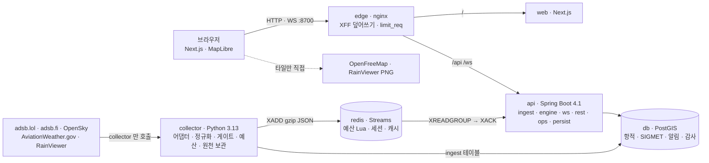

# SkyWx — 실시간 항공기 · 위험기상 상황판

전세계 항공기 위치(ADS-B), 기상 레이더, 항공 위험기상 경보(SIGMET), 공항 기상(METAR/TAF)을 한 지도에 겹치고,
**"지금 SIGMET 안에 있는 항공기"** 와 **"N분 뒤 진입할 항공기"** 를 근거 카드와 함께 실시간으로 찾아 주는 웹 서비스입니다.
1차 범위는 대한민국 상공(반경 250 NM, 10 s 갱신)이며 아시아 → 전세계(OpenSky, 120 s)로 확장하도록 설계했습니다.

> 개인 학습·포트폴리오용 · 비상업 · 로컬 실행. 운항 판단에 쓰면 안 됩니다. 모든 화면 값에 출처와 수집 시각이 붙고, 추정값(보간·예측)은 항상 "추정" 으로 표시합니다.

| 화면 | 주소 (127.0.0.1 바인딩) |
|---|---|
| 상황판 · 재생 · 통계 · 공항 · 출처 | http://localhost:8700 |
| 운영 화면(로그인) | http://localhost:8700/ops |
| 공개 REST v1 · OpenAPI | http://localhost:8700/api/v1/… · /api/v1/openapi |
| WebSocket v1 | ws://localhost:8700/ws/v1 |


### 한눈에

| | |
|---|---|
| **역할** | 1인 기획·설계·구현·검증 (수집기 · API/WS/공간 엔진 · 화면 · 인프라) |
| **스택** | nginx edge · Next.js 16 / React 19 / MapLibre GL 6 · Spring Boot 4.1 (Java 25, 가상 스레드, JTS) · Python 3.13 (asyncio, httpx, shapely) · PostgreSQL 18 + PostGIS 3.6 · Redis 8 Streams · Docker Compose 6 컨테이너 |
| **데이터** | adsb.lol / adsb.fi (readsb v2) · OpenSky (선택) · AviationWeather.gov (SIGMET·METAR·TAF) · RainViewer · OpenFreeMap |
| **핵심** | 수집 → Redis Streams(at-least-once) → 불변 스냅샷 → STRtree 교차·10분 예측 → 히스테리시스 FSM → bbox diff 팬아웃(가상 스레드) → PostGIS 이력·재생 |
| **보안** | 단일 진입점·XFF 덮어쓰기·IP 제한 2단·세션+CSRF 이중 제출·비인가 404·DB 역할 3개·비root/read-only 컨테이너·CSP nonce·비밀값 마스킹 |
| **검증** | 자동 테스트 98개 + 언어 간 계약 검사 + E2E 4건 · 실데이터로 찾은 문제 11건 기록([docs/VERIFICATION.md](docs/VERIFICATION.md)) · 성능 실측([docs/PERF.md](docs/PERF.md)) |
| **문서** | 설계서 v0.2([docs/](docs/)) · ADR 11건([docs/adr](docs/adr)) |

## 1. 풀려는 문제
1. 항공기 추적 서비스는 위치만, 기상 앱은 레이더만 보여 준다. "이 비행이 지금 뇌우 구역을 지나는가" 는 사람이 두 화면을 겹쳐 짐작해야 한다.
2. SIGMET 은 좌표 문자열과 고도대(FL)로 발표되고 유효시간이 지나면 조용히 사라진다.
3. 무료 데이터는 공급자마다 형식·단위·한도·약관이 다르고 자주 바뀐다(2026년에만 3곳).

→ 서버가 여러 공급자를 **한도 안에서** 수집·정규화·검증하고, SIGMET 을 폴리곤 + 고도대 + 유효시간으로 구조화해 공간 인덱스로 **판정**하며, 브라우저에는 **변경분만** 밀어준다.

## 2. 아키텍처



- **읽기와 수집의 분리**(ADR-001): 외부 지연·429 가 사용자 경로로 번지지 않는다. api 는 요청 처리 중 외부 API 를 부르지 않는다(ADR-006).
- **스트림이 경계**: 두 언어는 `schemas/*.json` 하나로 계약하고, CI 가 양쪽에서 같은 파일로 검증한다.
- **핫 상태는 메모리, 이력은 DB**: 스냅샷은 불변 맵 참조 교체(락 없음), STRtree 는 SIGMET 갱신 시에만 재구축, 판정은 병렬 스트림.
- **모든 값에 출처와 시각**: `meta: {provider, fetched_at, lag_s, stale, generated_at, request_id}`. 모르면 `—`.

### 데이터 흐름 (관심 지역 1주기 = 10 s)
예산 예약(Lua) → GET readsb v2 → 원천 gz 보관 → 정규화·품질 게이트(속도 > 1,200 kt · 고도 > 60,000 ft · 위치 점프 · 미래 시각 · 위치 없음 격리) → XADD → api XREADGROUP → 스키마 검증 → 스냅샷 교체 → 교차·예측 판정 → FSM(진입 2회·이탈 3회) → WS diff(bbox 구독자만) + 알림 → XACK → 항적 배치 저장(가상 스레드, 큐 상한 50,000).

## 3. 빠른 시작 (macOS Apple Silicon · Docker Desktop)

```bash
git clone <this repo> skywx && cd skywx
make up          # .env 생성(내부 비밀값 자동) + 6 컨테이너 빌드·기동 → http://localhost:8700
make ops-user    # 운영자 계정(프롬프트). 초기 검증용 admin 비밀번호는 .env 의 SKYWX_OPS_BOOTSTRAP_PASSWORD
```

외부 키는 **없어도 동작**합니다(adsb.lol·adsb.fi·AWC·RainViewer 는 무인증). 전세계 뷰만 OpenSky 자격증명이 필요합니다(`.env` 의 `OPENSKY_CLIENT_ID/SECRET`, collector 컨테이너에만 주입).
외부 호출 없이 데모하려면 `.env` 에 `SKYWX_FIXTURE_MODE=1` 을 두고 `make up` — 실응답 스냅샷(fixtures/)을 재생하며 한반도 위 합성 SIGMET 으로 알림이 뜹니다(화면에 FIXTURE 배지).

| 명령 | 내용 |
|---|---|
| `make test` | pytest 48 · JUnit 37 · Vitest 13 |
| `make contract` | Python 이 만든 메시지 ↔ JSON Schema ↔ Java 클래스패스 복사본 대조 |
| `make e2e` | fixture 모드로 띄운 뒤 Playwright 4 시나리오(`npx playwright install chromium` 필요) |
| `make bench` | k6 REST 100 rps · WS 200 연결(`brew install k6`). k6 없이는 `perf/quick_*.py` |
| `make logs s=api` | 로그 |
| `make clean` | 볼륨 포함 초기화 |

nginx 설정을 고친 뒤에는 `docker compose -f infra/compose.yml --env-file .env up -d --force-recreate edge` 로 재생성해야 합니다(단일 파일 bind mount 는 inode 가 바뀌면 컨테이너에서 사라짐).

## 4. 저장소 구조
```
apps/api         Spring Boot — dev.skywx.{ingest,engine,ws,rest,persist,ops,config} · Flyway V1 · JUnit
apps/collector   Python — providers · normalize · quality · sigmet_parse · budget · publisher · jobs · pytest
apps/web         Next.js — app/(상황판·replay·stats·airports·ops·about) · lib(ws·store·interpolate) · public/interpolate.worker.js
schemas/         aircraft_state.v1.json · sigmet.v1.json · stream_envelope.v1.json (계약의 단일 원천)
fixtures/        실응답 스냅샷(2026-09-27) + 합성 SIGMET(fixture_sigmet_kr.json, 원문에 SYNTHETIC 명시)
infra/           compose.yml · edge/nginx.conf · redis.conf · db/init/01-roles.sh
docs/            설계서 PDF · adr/ · VERIFICATION.md · PERF.md
perf/            k6 스크립트 · quick_rest.py · quick_ws.py · results/
tools/           init_env.py · contract_check.py
```

## 5. API 요약 (REST v1, 모든 응답에 `meta`)
`GET /aircraft?bbox=&detail=` (ETag · 5 s) · `/aircraft/{hex}` · `/aircraft/{hex}/track?from&to&step_s` · `/aircraft/search?q=` ·
`/sigmets?active&bbox&hazard` · `/sigmets/{id}` · `/alerts?kind=` · `/alerts/history?cursor` · `/radar/frames` · `/airports?bbox&watched` · `/airports/{icao}/wx` ·
`/replay?at&bbox` · `/stats/sigmet|traffic|alerts` · `/status` · `/healthz`(edge)
운영(세션+CSRF+ROLE_OPS, 비인가 404): `POST/GET/DELETE /ops/session` · `/ops/providers` · `POST /ops/providers/{name}/enable|disable` · `/ops/runs` · `/ops/quality` · `/ops/dlq` · `/ops/settings` · `PUT /ops/settings/{key}`(If-Match) · `/ops/audit`.
오류는 RFC 9457 `application/problem+json` + `code` + `request_id`. 요청 제한 429 + `Retry-After`.

## 6. 정직성 규칙(구현에 박힌 것)
- 서버 값은 `estimated=false` 만 스트림에 실린다(스키마 `const`). 브라우저 보간 결과만 `estimated=true` 이며 카드에 "지도 위치 추정 · dead reckoning" 배지가 뜬다.
- 예측 알림은 `PREDICTED` 로 유형이 다르고 점선·보라색 "추정" 배지. 선회 중(15° 초과)·60 kt 미만은 예측하지 않는다.
- 폴리곤을 만들 수 없는 SIGMET 은 목록에 원문으로 남기고 판정에서 제외하며 사유를 표시한다.
- 값이 없으면 `—`. 기종·등록번호는 공급자 값만. 비행 카테고리는 AWC 값을 우선하고 계산값은 "계산" 으로 표시.
- 품질 게이트가 거른 레코드는 화면에 나오지 않지만 원천에 남고 운영 화면에 규칙별 건수로 보인다.

## 7. 데이터 출처·약관
adsb.lol(ODbL 1.0) · adsb.fi(비상업, 초당 1회) · OpenSky(연구·비상업, 크레딧) · AviationWeather.gov(미 정부 공개, 분당 20회 자체 상한) · RainViewer(개인·교육, 줌 ≤ 7) · OpenFreeMap/OpenMapTiles/OpenStreetMap contributors. 화면 하단과 `/about` 에 상시 표기.
